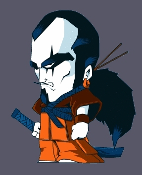



## BalPoint SimpleSkin

### Description

A verry good demonstration of how to creat a skinned form.
 
### More Info
 
The code uses a picturebox control and creates a skinned form.

The module uses a pixel 1x1 of teh picturebox and set's that as the transparent color. Then it traces around your image a eliminates the color all over the form

None Know

             |
---                |---
**Submitted On**   |2002-08-28 16:50:28
**By**             |[darklordz](https://github.com/Planet-Source-Code/PSCIndex/blob/master/ByAuthor/darklordz.md)
**Level**          |Intermediate
**User Rating**    |5.0 (35 globes from 7 users)
**Compatibility**  |VB 5\.0, VB 6\.0
**Category**       |[VB function enhancement](https://github.com/Planet-Source-Code/PSCIndex/blob/master/ByCategory/vb-function-enhancement__1-25.md)
**World**          |[Visual Basic](https://github.com/Planet-Source-Code/PSCIndex/blob/master/ByWorld/visual-basic.md)
**Archive File**   |[BalPoint\_S14840810192002\.zip](https://github.com/Planet-Source-Code/darklordz-balpoint-simpleskin__1-39969/archive/master.zip)

